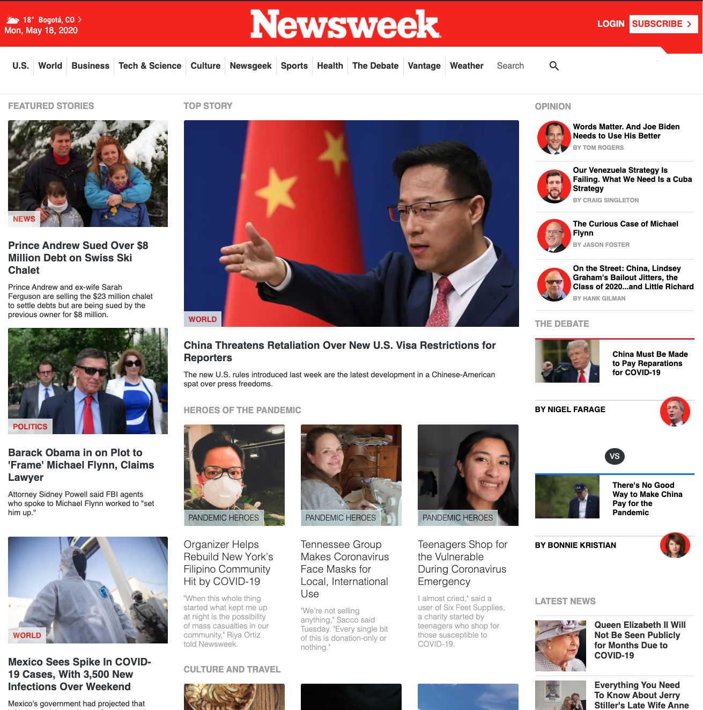

# Project Name

> Cloning [this](https://www.newsweek.com/) page from Newsweek as part of Microverse Main Curriculum to learn Bootstrap framework.

Use bootstrap properly to clone the Newsweek home page and mimick its layout even with different screen sizes.

## Built With

- HTML,
- CSS,
- Bootstrap 4.4

## Live Demo

[Live Version](https://raw.githack.com/santiagorodriguezbermudez/newsweek-clone/feature-homepage/index.html)

## Authors

👤 **Santiago Rodriguez**

- Github: [@santiagorodriguezbermudez](https://github.com/santiagorodriguezbermudez)
- Twitter: [@srba87](https://twitter.com/srba87)
- Linkedin: [srba87](https://www.linkedin.com/in/srba87/)

## 🤝 Contributing

Contributions, issues and feature requests are welcome!

Feel free to check the [issues page](issues/).

## Show your support

Give a ⭐️ if you like this project!

## 📝 License

This project is [MIT](lic.url) licensed.
